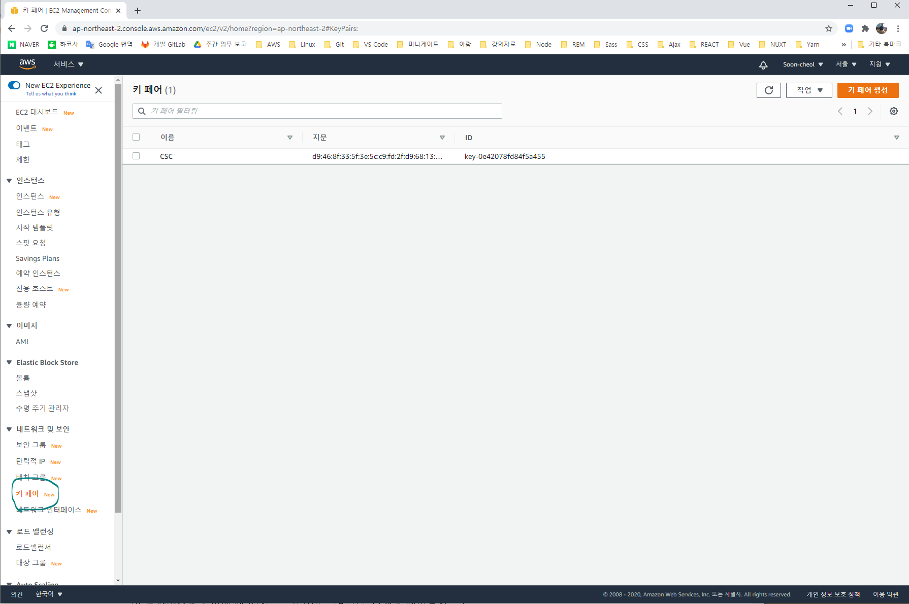
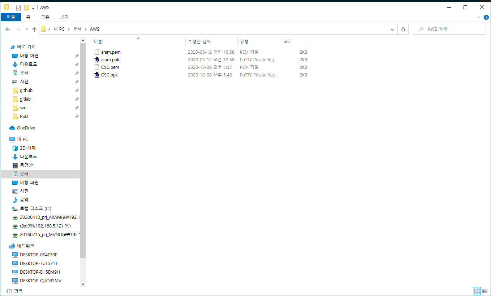
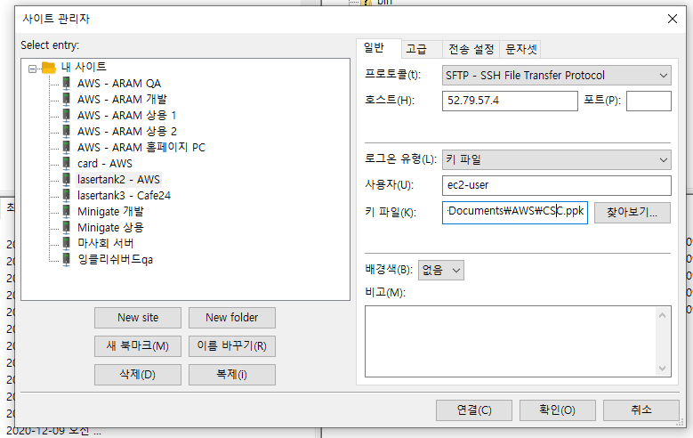

# 1. AWS 접속하기

## 1-1. 터미널로 접속

<br />

<div style="text-align:center">
  
</div>

<div style="text-align:center">
  
</div>

<br />

터미널로 접속하는 방식은 아래와 같다.

`로컬 키파일 경로@공인 아이피`

```
ssh -i C:/Users/admin/Documents/AWS/CSC.pem ec2-user@52.79.57.4
ssh -i C:/Users/admin/Documents/AWS/CSC.pem ec2-user@15.164.245.6
```

기본 리모트 경로 : `/home/ec2-user`

---

## 1-2. FTP 접속

<br />

<div style="text-align:center">
  
</div>

<br />

---

<br />

# 2. Node 설치

```js
$ curl -o- https://raw.githubusercontent.com/nvm-sh/nvm/v0.34.0/install.sh | bash
$ . ~/.nvm/nvm.sh
$ nvm install node
$ node -v
```

Node 설치 시 `/home/ec2-user` 에 `.nvm, .npm` 폴더가 생성된다.

설치되는 Node 모듈들 또한 `/home/ec2-user` 에 저장된다.

---

<br />

# 3. 작업 Root 설정

<br />

최상위 경로에서

```js
sudo mkdir app // 관리자 권한으로 app 폴더 생성
cd app // app 폴더로 이동
```

app 폴더에서 service 폴더 생성

```js
mkdir service
// -> mkdir: cannot create directory 'service': Permission denied
// 현재 로그인은 ec2-user 계정이고 폴더의 편집 권한이 root 이므로, 권한이 거부됨
// sudo : sudo 는 root가 아닌 사용자가 root에 준하는 능력을 일회성으로 가지게 되는 명령어
// su : 다른 계정으로 전환
// su - : 다른계정으로 전환 + 그 계정의 환경변수 적용
sudo mkdir service
// -> sudo 명령어로 생성 완료
```

sudo 명령어로 폴더 편집 권한 ec2-user 에 부여

```js
sudo chown ec2-user:ec2-user ./service/
```

---

<br />

# 4. Node Background Run (Cli 에 사용)

<br />

```js
npm run serve &
```

---

nohup 이란?

리눅스, 유닉스에서 쉘스크립트 파일(\*.sh)을 데몬형태로 실행시키는 프로그램

터미널 세션이 끊겨도 실행을 멈추지 않고 동작하도록 함

---

& 이란?

프로세스를 실행할 때 백그라운드에서 동작하도록 만드는 명령어

---

실행중인 프로세스 확인 명령어

```
ps -ef
```

---

실행중인 프로세스 종료 명령어

```
kill -9 pid
```

---

<br />

# 5. PM2 (Nuxt 에 사용)

<br />

```
pm2 start ecosystem.config.js --env production
```
