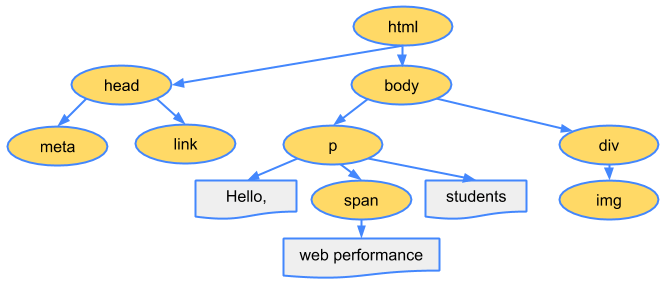

# 1. HTML 브라우저 렌더링 과정

## 1-1. DOM(Document Object Model), CSSOM(CSS Object Model) 생성

<br />

- 웹페이지 진입 시 브라우저는 서버로 부터 HTML과 CSS 파일을 다운로드 받습니다.

- 다운로드 받은 HTML, CSS는 단순한 텍스트 파일이므로 브라우저가 연산과 관리가 유리하도록 Object Model로 만듭니다. <b>-> DOM Tree / CSSOM Tree</b><br /><br />
  <div style="text-align:center">
    
  </div>
  <br />
  <br />
  <div style="text-align:center">
    
  </div>
  <br />
  <br />
자세한 과정은 <a href="https://developers.google.com/web/fundamentals/performance/critical-rendering-path/constructing-the-object-model?hl=ko" target="_blank">Google 개발자</a> 문서를 통해 확인할 수 있습니다.
  <br />
  <br />

---

<br />

## 1-2. Render Tree 생성

<br />

- DOM Tree와 CSSOM Tree를 이용해서 Render Tree를 생성합니다. (DOM Tree + CSSOM Tree)

- <b>실제 화면에 표현되는 노드들로만 구성</b>됩니다.

<div style="text-align:center">
  
</div>
<br />
<br />

실제 화면에 표현되는 노드들로만 구성이 된다는 이야기는 'display: none' 속성이 설정된 노드는 화면에서

어떠한 공간도 차지않기 때문에 Render Tree를 만드는 과정에서 제외됩니다. (display:none 과 visible: invisible 의 차이점)
<br />
<br />

---

<br />

## 1-3. Layout

<br />

Layout 단계는 브라우저의 뷰포트(Viewport) 내에서 각 노드들의 정확한 위치와 크기를 계산합니다.

풀어서 얘기하자면 생성된 Render Tree 노드들이 가지고 있는 스타일과 속성에 따라서 브라우저 화면의 어느위치에 어느크기로

출력될지 계산하는 단계라고 할 수 있습니다. Layout 단계를 통해 %, vh, vw와 같이 상대적인 위치, 크기 속성은 실제 화면에

그려지는 pixel단위로 변환됩니다.
<br />
<br />

<div style="text-align:center">
  
</div>
<br />
<br />

여기서 뷰포트(Viewport)란 그래픽이 표시되는 브라우저의 영역, 크기를 말합니다. 뷰포트는 모바일의 경우 디스플레이의

크기, PC의 경우 브라우저 창의 크기에 따라 달라집니다. 그리고 화면에 그려지는 각 요소들의 크기와 위치는 %, vh, vw와

같이 상대적으로 계산하여 그려지는 경우가 많기 때문에 viewport 크기가 달라질 경우 매번 계산을 다시해야 합니다.
<br />
<br />

---

<br />

## 1-4. Paint

<br />

Layout 계산이 완료되면 이제 요소들을 실제 화면을 그리게 됩니다. 이전 단계에서 이미 요소들의 위치와 크기, 스타일

계산이 완료된 Render Tree 를 이용해 실제 픽셀 값을 채워넣게 됩니다. 이 때 텍스트, 색, 이미지, 그림자 효과등이 모두 처리되어 그려집니다.

이 때 처리해야 하는 스타일이 복잡할수록 Paint 단계에 소요되는 시간이 늘어나게 됩니다. 간단한 예시로 단순한 단색 background-color의 경우

paint 속도가 빠르지만 그라데이션이나 그림자 효과등은 painting 소요시간이 비교적 더 오래 소요됩니다.
<br />
<br />

---

<br />

## 1-5. Reflow (Layout)

<br />

위에서 언급된 렌더링 과정을 거친 뒤에 최종적으로 페이지가 그려진다고 해서 렌더링 과정이 다 끝난것이 아닙니다.

어떠한 액션이나 이벤트에 따라 html 요소의 크기나 위치등 레이아웃 수치를 수정하면 그에 영향을 받는 자식 노드나

부모 노드들을 포함하여 Layout 과정을 다시 수행하게 됩니다. 이렇게 되면 Render Tree와 각 요소들의 크기와 위치를

다시 계산하게 되고 이 과정을 Reflow라고 합니다.

```js
// reflow 발생 예제
function reflow() {
  document.getElementById("content").style.width = "600px";
}
```

Reflow가 일어나는 대표적인 경우는 아래와 같습니다.

- 페이지 초기 렌더링 시 (최초 Layout 과정)

- 윈도우 리사이징 시 (Viewport 크기 변경시)

- 노드 추가 또는 제거

- 요소의 위치, 크기 변경 (left, top, margin, padding, border, width, height, 등..)

- 폰트 변경 과(텍스트 내용) 이미지 크기 변경 (크기가 다른 이미지로 변경 시)

<br />
<br />

---

<br />

## 1-7. Repaint (Paint)

<br />

Reflow를 했다면 변경된 내용을 화면에 적용하기 위해서는 Paint 단계가 다시 수행되는 Repaint 를 해야 합니다.

<br />

---

<br />
<br />

# 2. 렌더링 최적화

## 2-1. Reflow, Repaint 줄이기

<br />

1-7의 Repaint는 Reflow가 일어나면 무조건 일어나는 것은 아닙니다.

background-color, visibility와 같이 레이아웃 자체에 영향을 주지 않는 스타일 속성이 변경되었을 때는 Reflow를

수행할 필요가 없기 때문에 Repaint만 수행하게 됩니다.

  <div style="text-align:center">
    
  </div>
