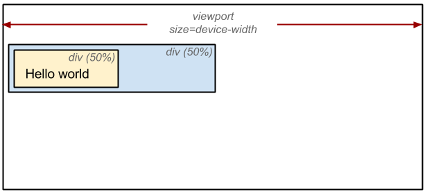

# 1. HTML 브라우저 렌더링 과정

## 1-1. DOM(Document Object Model), CSSOM(CSS Object Model) 생성

<br />

- 웹페이지 진입 시 브라우저는 서버로 부터 HTML과 CSS 파일을 다운로드 받습니다.

- 다운로드 받은 HTML, CSS는 단순한 텍스트 파일이므로 브라우저가 연산과 관리가 유리하도록 Object Model로 만듭니다. <b>-> DOM Tree / CSSOM Tree</b><br /><br />
  <div style="text-align:center">
    
  </div>
  <br />
  <br />
  <div style="text-align:center">
    
  </div>
  <br />
  <br />
자세한 과정은 <a href="https://developers.google.com/web/fundamentals/performance/critical-rendering-path/constructing-the-object-model?hl=ko" target="_blank">Google 개발자</a> 문서를 통해 확인할 수 있습니다.
  <br />
  <br />

---

<br />

## 1-2. Render Tree 생성

<br />

- DOM Tree와 CSSOM Tree를 이용해서 Render Tree를 생성합니다.

- Render Tree의 생성 과정에서 각 요소의 스타일이 계산이 되며, 다른 요소들의ㅑ 스타일 속성 참조도 일어납니다.

- <b>실제 화면에 표현되는 노드들로만 구성</b>됩니다.

  <br />
  <br />

<div style="text-align:center">
  
</div>

<br />
<br />

실제 화면에 표현되는 노드들로만 구성이 된다는 이야기는 'display: none' 속성이 설정된 노드는 화면에서 어떠한 공간도 차지않기

때문에 Render Tree를 만드는 과정에서 제외됩니다. (display:none 과 visible: invisible 의 차이점)

<br />
<br />

---

<br />
<br />

<div style="text-align:center">
  
</div>

<br />
<br />

---

<br />

## 1-3. Layout

<br />

Layout 단계는 브라우저의 뷰포트(Viewport) 내에서 각 노드들의 정확한 위치와 크기를 계산합니다.

풀어서 얘기하자면 생성된 Render Tree 노드들이 가지고 있는 스타일과 속성에 따라서 브라우저 화면의 어느위치에 어느크기로

출력될지 계산하는 단계라고 할 수 있습니다. Layout 단계를 통해 %, vh, vw와 같이 상대적인 위치, 크기 속성은 실제 화면에

그려지는 pixel단위로 변환됩니다.
<br />
<br />

<div style="text-align:center">
  
</div>
<br />
<br />

여기서 뷰포트(Viewport)란 그래픽이 표시되는 브라우저의 영역, 크기를 말합니다. 뷰포트는 모바일의 경우 디스플레이의

크기, PC의 경우 브라우저 창의 크기에 따라 달라집니다. 그리고 화면에 그려지는 각 요소들의 크기와 위치는 %, vh, vw와

같이 상대적으로 계산하여 그려지는 경우가 많기 때문에 viewport 크기가 달라질 경우 매번 계산을 다시해야 합니다.
<br />
<br />

---

<br />

## 1-4. Paint

<br />

Layout 계산이 완료되면 이제 요소들을 실제 화면을 그리게 됩니다. 이전 단계에서 이미 요소들의 위치와 크기, 스타일

계산이 완료된 Render Tree 를 이용해 실제 픽셀 값을 채워넣게 됩니다. 이 때 텍스트, 색, 이미지, 그림자 효과등이 모두 처리되어 그려집니다.

이 때 처리해야 하는 스타일이 복잡할수록 Paint 단계에 소요되는 시간이 늘어나게 됩니다. 간단한 예시로 단순한 단색 background-color의 경우

paint 속도가 빠르지만 그라데이션이나 그림자 효과등은 painting 소요시간이 비교적 더 오래 소요됩니다.
<br />
<br />

---

<br />

## 1-5. Reflow (Layout)

<br />

위에서 언급된 렌더링 과정을 거친 뒤에 최종적으로 페이지가 그려진다고 해서 렌더링 과정이 다 끝난것이 아닙니다.

생성된 DOM 노드의 레이아웃 수치(너비, 높이, 위치 등) 변경 시 영향을 받은 모든 노드들(부모, 자식)의 수치를 다시

계산하여, Render Tree 를 재생성하고 <b>Layout 과정을 다시 수행하게</b> 되며, 이 과정을 Reflow라고 합니다.
<br />

```js
// reflow 발생 예제
function reflow() {
  document.getElementById("content").style.width = "600px";
}
```

Reflow가 일어나는 대표적인 경우는 아래와 같습니다.

- 페이지 초기 렌더링 시 (최초 Layout 과정)

- 윈도우 리사이징 시 (Viewport 크기 변경시)

- 노드 추가 또는 제거

- 요소의 위치, 크기 변경 (left, top, margin, padding, border, width, height, 등..)

- 폰트 변경 과(텍스트 내용) 이미지 크기 변경 (크기가 다른 이미지로 변경 시)

<br />
<br />

---

<br />

## 1-7. Repaint (Paint)

<br />

Reflow를 했다면 변경된 내용을 화면에 적용하기 위해서 Paint 단계가 다시 수행되는 Repaint 가 일어납니다.

<br />

---

<br />
<br />

# 2. 렌더링 최적화

## 2-1. Reflow, Repaint 줄이기

<br />

1-7의 Repaint는 Reflow가 일어나면 무조건 일어나는 것은 아닙니다.

background-color, visibility와 같이 레이아웃 자체에 영향을 주지 않는 스타일 속성이 변경되었을 때는 Reflow를

수행할 필요가 없기 때문에 Repaint만 수행하게 됩니다.

<br />
<br />

  <div style="text-align:center">
    
  </div>

<br />
<br />
또한 Reflow Repaint가 일어나지 않는 transform, opacitiy와 같은 속성도 있습니다.

<br />
<br />

---

<br />

## 2-2. 영향을 주는 노드 줄이기

<br />

Javascript + CSS 를 조합하여 애니메이션이 많거나 레이아웃 변화가 많은 요소의 경우 position을 absolute 또는 fixed를 사용하여

영향을 받는 주변 노드들을 줄일 수 있습니다.

fixed와 같이 영향을 받는 노드가 전혀 없는 경우 reflow과정이 전혀 필요가 없어지기 때문에 Repaint 연산비용만 들게 됩니다.

또다른 방법은 애니메이션 시작시 요소를 absolute, fixed로 변경 후 애니메이션이 종료되었을 때 원상복구 하는 방법도 Reflow, Repaint

연산을 줄이는대에 도움이 됩니다.

<br />
<br />

---

<br />

## 2-3. 프레임 줄이기

<br />

단순히 생각하면 0.1초에 1px씩 이동하는 요소보다 3px씩 이동하는 요소가 Reflow, Repaint 연산비용이 3배가 줄어든다고 볼 수 있습니다.

따라서 부드러운 효과를 조금 줄여 성능을 개선할 수 있습니다.
<br />
<br />

---

<br />

## 2-4. 퀄리티와 퍼포먼스 사이에서 타협하라.

<br />

에니메이션 효과는 보통 무수히 많은 Reflow 비용이 들어가게 됩니다.

물론, 디바이스 환경에 따라 큰 성능 차이를 보일 수 있겠지만, 스마트폰 기기와 같은 경우 그리 좋은 성능을 보이지 못합니다.

따라서 에니메이션 효과와 같은 CPU 퍼포먼스 비용이 큰 작업은 언제나 퀼리티와 퍼포먼스 사이에 적당한 타협이 필요합니다.
<br />
<br />

---

<br />

## 2-5. 테이블 레이아웃을 피하라.

<br />

테이블로 구성된 페이지 레이아웃은 점진적(progressive) 페이지 렌더링이 적용되지 않으며, 모두 로드되고 계산(Recalculate)된

후에야 화면에 뿌려지게 됩니다.

하지만 해당 테이블에 table-layout:fixed 속성을 주는 것이 디폴트값인 auto에 비해 성능면에서 더 좋다고 한다.
<br />
<br />

### 2-5-1. 점진적 렌더링이란?

<br />

점진적 렌더링(Progressive Rendering)은 서버에서 웹 페이지의 일부를 순차적으로 렌더링하고 전체 페이지가 렌더링 될 때까지 기다리지 않고,

부분적으로 클라이언트에 스트리밍하는 기술이다.

### 2-5-2. CSR (Client Side Rendering)

<br />

CSR은 서버가 본문에 내용이 없고 head에 `<script>` 가 없는 간단한 HTML을 보내는 기술이다. (create-react-app build output)

<br />

1. 브라우저, 서버 측에 HTML 요청
2. 서버, head에 `<script>`를 포함하고 본문에 내용이 없는 `HTML` 전송\
3. 브라우저는 HTML 파싱 후, script 로드 위해 http 요청
4. script 로드 후, 브라우저는 script 구문 분석 및 API 요청 후 모든 콘텐츠 비동기식 로드

<br />

#### 2-5-2-1. 장점

<br />

- 초기 JavaScript가 로드되면 컨텐츠를 비동기적으로 로드 가능

- 중요도 순으로 컨텐츠 로드 가능

- 초기 로드된 JavaScript bundle은 브라우저에 캐시되어 다중 접속하는 사용자에게 도움

<br />

#### 2-5-2-2. 단점

<br />

- 초기 로드된 JavaScript는 컨텐츠로드 차단하여, bundle 크기가 클수록 컨텐츠 표시에 오래 걸림

- 서버 위치가 전 세계 분포 시, 지연 시간이 길고 대역폭이 낮기 때문에 느린 네트워크에서는 더욱 지연

- 일반적인 SEO 불가능 (구글은 가능하나 점수는 비교적 낮게 측정될수 있음)

<br />

---

<br />

### 2-5-3. SSR (Server Side Rendering)

<br />

SSR은 전체 HTML이 서버에서 렌더링되고 클라이언트로 전송되는 기술이다. (Next.js, Gatsby)

<br />

1. 브라우저, 서버 측에 HTML 요청
2. 서버, API 요청 생성 및 컨텐츠 렌더링
3. 서버 측, 페이지 준비되면 브라우저로 전송 (브라우저는 HTML을 로드 및 구문 분석하고, JavaScript bundle이 로드 될 때까지 기다리지 않고 화면에 콘텐츠 표시)
4. JavaScript bundle이 로드되면 브라우저는 이벤트 핸들러 및 기타 상호 작용 동작을 연결하는 DOM 요소에 대한 상호 작용 수행

<br />

API는 일반적으로 서버와 같은 위치에 있기에, 컨텐츠가 빠르게 로드되고 (CSR보다 빠름) HTML이 브라우저로 전송된다.

서버에서 보낸 HTML에 이미 컨텐츠가 있으므로 초기 JavaScript 로드는 컨텐츠로드를 차단하지 않는다.

<br />

#### 2-5-3-1. 장점

<br />

- 서버는 컨텐츠와 함께 HTML을 제공하므로, 브라우저나 검색 엔진 모두 콘텐츠에 대해 JavaScript에 의존 할 필요없음

- JavaScript bundle을 로드하는데 걸리는 시간에 콘텐츠 차단안됨

- 페이지가 CSR보다 훨씬 빠르게 로드됨

<br />

#### 2-5-3-2. 단점

<br />

- 전체 HTML은 클라이언트로 보내기 전에 서버에서 렌더링 되어야 하기에, 응답 HTML을 클라이언트에 보내기 전에 중요하지 않은 컨텐츠도 서버에서 렌더링해야함

<br />

<br />

---

<br />

### 2-5-4. PR (Progressive Rendering)

<br />

PR(또는 PSSR)은 서버에서 중요한 컨텐츠를 렌더링한 후, 중요하지 않은 콘텐츠를 기다리지 않고 클라이언트로 스트리밍하는 기술이다.

그런 다음 서버에서 렌더링되면 나중에 중요하지 않은 콘텐츠를 스트리밍한다. 브라우저는 중요한 콘텐츠에 대한 chunk가 수신되는

즉시 페이지에서 HTML을 점진적으로 렌더링 (페인트)하기 시작한다. 그리고 브라우저가 서버에서 수신 할 때 중요하지 않은 콘텐츠는

나중에 페이지에서 렌더링 (페인트)된다.

<br />

1. 브라우저, 서버 측에 HTML 요청
2. 서버에서 API request 생성 후, 중요 콘텐츠 우선 렌더링하고 브라우저로 스트리밍
3. 브라우저, HTML 청크 로드 후 렌더링(paint)
4. 서버에서 중요하지 않은 컨텐츠를 렌더링하여 클라이언트로 스트리밍
5. 브라우저, 나중에 중요하지 않은 컨텐츠 수신하고 렌더링(paint)
6. 전체 페이지 로드 후, 브라우저는 일반적으로 이벤트 핸들러 및 기타 상호작용 동작을 연결하는 DOM element에 대한 상호 작용 수행

<br />

PR은 CSR과 SSR의 이점을 연결한다. API는 서버에 함께있기 때문에 컨텐츠가 빠르게 렌더링되는 동시에, 덜 중요한 컨텐츠를 기다리지 않고도 중요 콘텐츠를 빠르게 렌더링 할 수 있다.

PR을 사용하면 JavaScript를 사용하여 컨텐츠를 로드하지 않고도 비동기식으로 사이트를 더 빠르게 로드 할 수 있다.

<br />

#### 2-5-4-1. 장점

<br />

- 서버에서 중요한 컨텐츠를 먼저 클라이언트로 스트리밍

- JavaScript bundle을 로드하는데 걸리는 시간에 컨텐츠 미차단

- CSR과 SSR보다 빠른 페이지 로드

<br />

#### 2-5-4-2. 단점

<br />

- 컨텐츠가 빠르게 표시 되더라도 중요하지 않은 콘텐츠가 로드된 후, 상호 작용 활성화

- PR이 확립된 프레임워크가 없으며, 웹 애플리케이션의 한계에 대한 의존도 높음

<br />

---

<br />

# 3. React, Vue의 Virtual DOM, Angular Change Detector는 왜 필요한가?

일반적으로 DOM에 접근하여 여러번의 속성 변화, 여러번의 스타일 변화를 수행하면 그에따라 여러번의 Reflow, Repaint가 발생하게 됩니다.

하지만 Virtual DOM은 이렇게 변화가 일어나 Reflow, Repaint가 필요한 것들을 한번에 묶어서 DOM에 전달하게 됩니다. 따라서 처리되는

Reflow, Repaint의 규모가 커질 수는 있지만 <b>한번만 연산을 수행</b>하게 됩니다.

이를 통해 여러번 Reflow, Repaint를 수행하며 브라우저의 반복적으로 연산을 줄여 성능이 개선됩니다.

<br />

---

<br />
<br />
