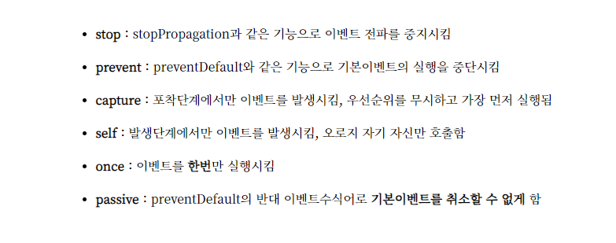

# 1. Event

<div style="text-align:center">
  
</div>

---

## self 와 stop 차이

```html
<!DOCTYPE html>
<html lang="ko">
  <head>
    <meta charset="UTF-8" />
    <meta http-equiv="X-UA-Compatible" content="IE=edge" />
    <meta name="viewport" content="width=device-width, initial-scale=1.0" />
    <title>Document</title>
    <script src="https://cdn.jsdelivr.net/npm/vue/dist/vue.js"></script>
  </head>
  <body>
    <div id="app">
      <div class="root" @click="log('root')">
        root
        <div class="parent" @click.self="log('parent')">
          Parent
          <!-- <div class="parent" v-on:click.stop="log('parent')">Parent -->
          <div class="child" @click="log('child')">child</div>
        </div>
      </div>
    </div>
    <script type="text/javascript">
      var app = new Vue({
        el: "#app",
        methods: {
          log(txt) {
            console.log("txt", txt);
          },
        },
      });
    </script>
  </body>
</html>
```
