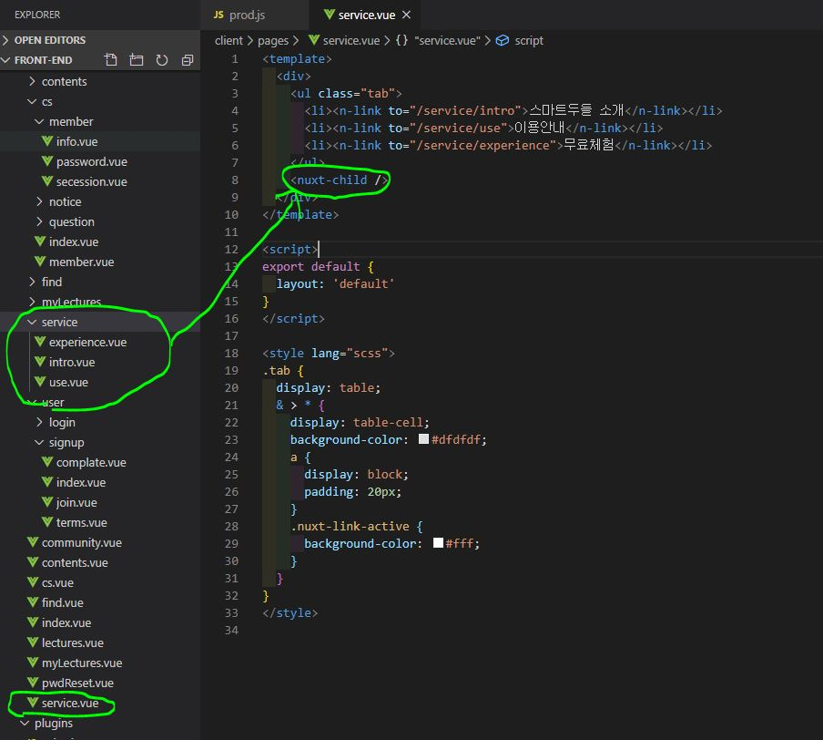
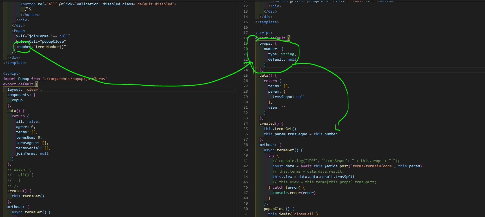
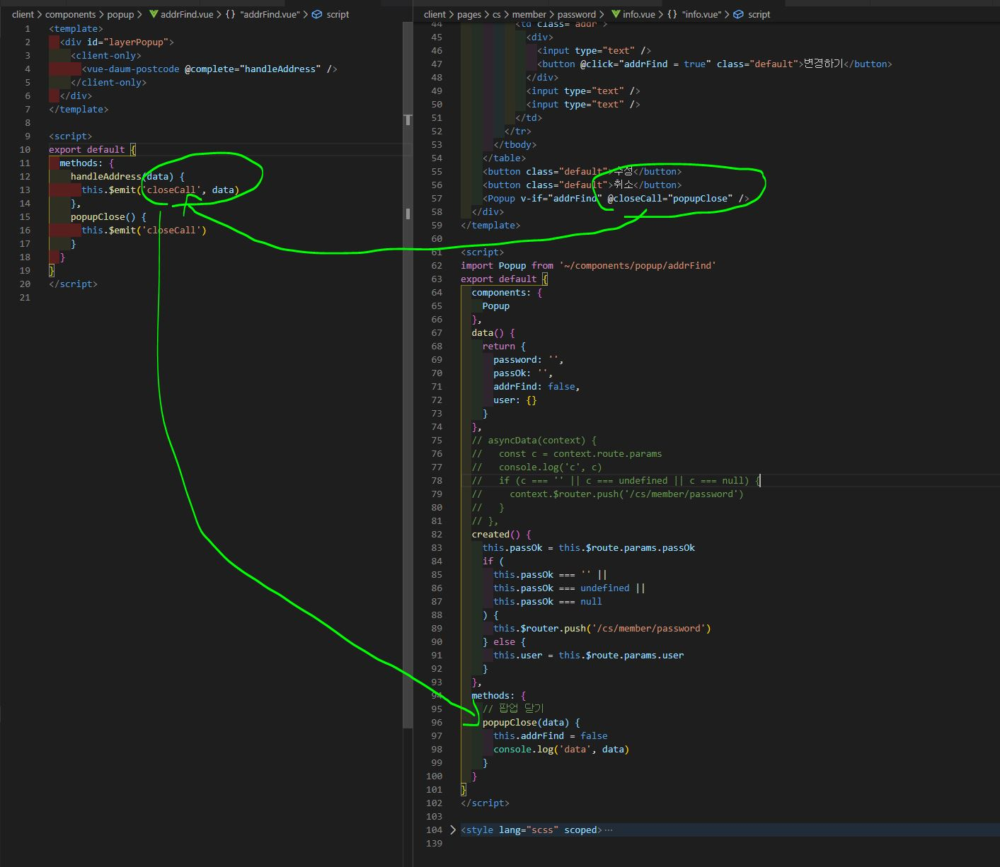
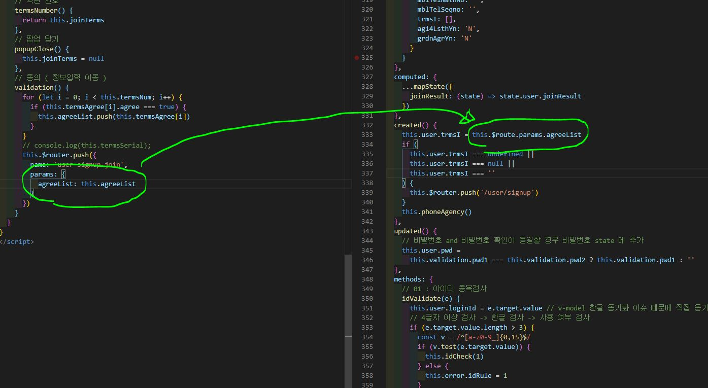

# Nuxt 자주 쓰는 문법 정리

- Tab 페이지 구조



---

- STORE 이용해서 API 통신 기본

1. vue

```js
import { mapState } from "vuex";

export default {
  computed: {
    ...mapState({
      detail: (state) => state.qna.lists,
    }),
  },
  async asyncData({ store }) {
    await store.dispatch("qna/lists");
  },
};
```

2. store

store/qna.js

```js
export const state = () => {
  lists: [];
};
export const mutations = {
  SET_LISTS(state, payload) {
    state.lists = payload;
  },
};
export const actions = {
  async lists({ commit }) {
    try {
      const { data } = await this.$axios.get("board/my-edu/question");
      console.log("data", data);
      commit("SET_LISTS", data.result);
    } catch (e) {
      return e;
    }
  },
};
```

---

- 부모에서 자식 컴포넌트에 Props 전달



---

- 자식에서 부모 컴포넌트에 이벤트 실행 및 파라미터 전달



---

- router 이동

```js
this.$router.push("/cs/member/password/info");

this.$router.push({
  name: "user-signup-join",
  params: {
    agreeList: this.agreeList,
  },
});
```

---

- 라우터로 Parameter 전달할 경우 받는 법



---

- asyncData

```
절대로 asyncData 안에서 컴포넌트를 참조하기 위해 this를 사용하지 마세요.
컴포넌트가 생성되기 전에 호출되기 때문에 this에 엑세스할 수 없습니다.
```

1. Promise 객체 사용하기

```js
export default {
  asyncData({ params }) {
    return axios.get(`https://my-api/posts/${params.id}`).then((res) => {
      return { title: res.data.title };
    });
  },
};
```

2. async/await 사용하기

```js
export default {
  async asyncData({ params }) {
    const { data } = await axios.get(`https://my-api/posts/${params.id}`);
    return { title: data.title };
  },
};
```

3. context 에서 axios 사용 가능

```js
  asyncData(context) {
    console.log('context', context)
  }
```

```js
app:
store: Store {_committing: false, _actions: {…}, _actionSubscribers: Array(0), _mutations: {…}, _wrappedGetters: {…}, …}
router: VueRouter {app: Vue, apps: Array(1), options: {…}, beforeHooks: Array(2), resolveHooks: Array(0), …}
nuxt: {…}
head: {title: "smart-doodle", meta: Array(4), link: Array(15), script: Array(2), style: Array(0)}
render: ƒ render(h, props)
data: ƒ data()
beforeCreate: ƒ beforeCreate()
created: ƒ created()
mounted: ƒ mounted()
watch: {nuxt.err: "errorChanged"}
computed: {isOffline: ƒ}
methods: {refreshOnlineStatus: ƒ, refresh: ƒ, errorChanged: ƒ, setLayout: ƒ, loadLayout: ƒ}
components: {NuxtLoading: {…}}
context: {isStatic: false, isDev: true, isHMR: false, app: {…}, store: Store, …}
$axios: ƒ wrap()
$auth: Auth {ctx: {…}, options: {…}, strategies: {…}, _errorListeners: Array(0), _redirectListeners: Array(0), …}
```

---

- 구조분해 할당으로 API 값 가져오기

```js
  async beforeMount() {
    // 디폴트 - 학습자료실
    const { result, ok } = await this.$axios.$get(
      'board/edu-info/referenceRoom'
    )
    console.log('data', result, ok)
  },
```
