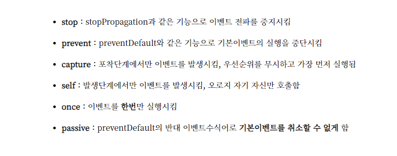

# Vue.js 정리


# 1. Event

<div style="text-align:center">
  
</div>

---

## self 와 stop 차이

```html
<!DOCTYPE html>
<html lang="ko">
  <head>
    <meta charset="UTF-8" />
    <meta http-equiv="X-UA-Compatible" content="IE=edge" />
    <meta name="viewport" content="width=device-width, initial-scale=1.0" />
    <title>Document</title>
    <script src="https://cdn.jsdelivr.net/npm/vue/dist/vue.js"></script>
  </head>
  <body>
    <div id="app">
      <div class="root" @click="log('root')">
        root
        <div class="parent" @click.self="log('parent')">
          Parent
          <!-- <div class="parent" v-on:click.stop="log('parent')">Parent -->
          <div class="child" @click="log('child')">child</div>
        </div>
      </div>
    </div>
    <script type="text/javascript">
      var app = new Vue({
        el: "#app",
        methods: {
          log(txt) {
            console.log("txt", txt);
          },
        },
      });
    </script>
  </body>
</html>
```

---


## Computed VS Watch vs Method

- watch를 사용해야할 경우

1. mustache(템플릿 표현식) 없이 값의 변화를 관찰하고 싶을때는 watch를 사용한다.
2. 비동기적 처리시 사용한다!
3. 값이 바뀔 때마다 매번 호출되어야 할 경우
4. 연산을 얼마나 자주 수행하는지 제한가능(lodash의 debounce 이용)

- computed 사용해야 할 경우

1. 종속된 값의 변화를 관찰하고 싶은 경우
2. mustache(템플릿 표현식) 을 사용하는 경우
3. 동기 호출에 무관할 경우<br />
   input의 v-model로 서버호출이 필요한데 computed 를 사용할 경우,<br />
   입력이 멈춰버린다. 값을 직접 리턴해야하기 때문.
4. 동일한 인풋 값에 대해선, 캐싱이 적용된다!

https://skout90.github.io/2018/01/24/Vue/1.1.Computed-VS-Watch/

---

watch는 "부수 효과" 처리를 위한 것이다. 만약 상태를 변경하고 싶다면 computed를 사용하는 것이 좋다.
"부수 효과"는 컴포넌트 외부의 동작이나 비동기 처리를 말한다.
